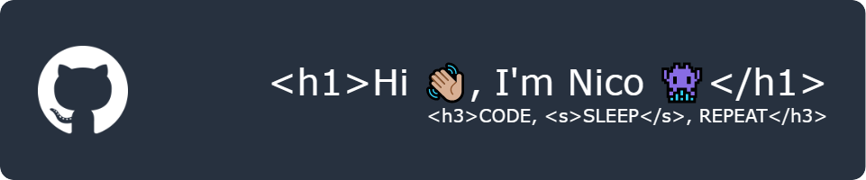

- 🔭 I’m currently working on | [DragboxJS](https://github.com/nico-barbieri/dragbox-js)

- 🌱 I’m currently learning | **Node.js, Unity**

- 📫 How to reach me | **nicobarbieri.m@gmail.com**

- 💙 About me | **I love arts, technology, and - most of all - the combination between the two.**

<h3 align="left">Connect with me:</h3>

<h3 align="left">Languages and Tools:</h3>

  
  
  
  
  
  
  
  
  
  
   
  
  
  
  
   
  
  
  

